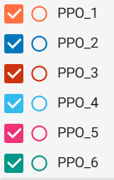
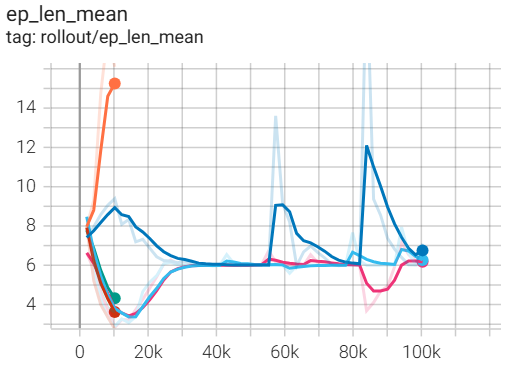
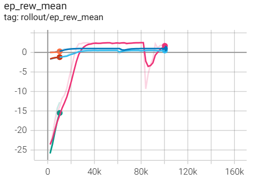

# Lab 13 Reinforcement Learning Lab Report

## Custom Reward Function 1
- A very simple reward function where the agent only receives a positive reward of 1 when it reaches the goal (state 15), otherwise the agent yields a reward of 0.
- The first iteration with total_timesteps=int(1e4) is shown as PPO1 in the graphs below. The second iteration with total_timesteps=int(1e5) is shown as PPO2 in the graphs below.
- The reward function gave the agent a reward of 1 only when it reached the goal (state 15), and 0 otherwise. This made learning difficult at first because the agent got no feedback unless it completed the task. When trained for just 1e4 timesteps, the agent did not have enough experience to figure things out, so its mean reward stayed at 0. But after increasing the training time to 1e5 timesteps, the agent had enough time to explore, learn from rare successes, and eventually master the task. So while the reward function was sparse, it was still effective with enough training, the agent just needed more time to learn what actions led to that single rewarding state.

## Custom Reward Function 2
- A reward function that penalizes the agent if it lands on holes. Also, the agent receives a small negative reward for non-goal steps. This should hopefully encourage efficiency through shorter paths.
- The first iteration with total_timesteps=int(1e4) is shown as PPO3 in the graphs below. The second iteration with total_timesteps=int(1e5) is shown as PPO4 in the graphs below.
- The new reward function gave the agent more guidance by not only rewarding the goal with +1, but also penalizing holes with -1 and giving a small -0.1 penalty for every regular step. This helped the agent learn faster since it could now tell when it was doing something wrong, like falling into a hole or taking too long. At 1e4 timesteps, it still struggled and had a low mean reward, but after training for 1e5 timesteps, the agent started to improve and reached a mean reward of 0.5. So overall, the more informative reward function helped the agent learn better behavior more quickly.

## Custom Reward Function 3
- A reward function that will hopefully provide more specific feedback by calculating the distance from the current state to the goal. The agent will receive a positive reward of 10 when it reaches the goal state, a negative reward of -10 when it reaches any of the holes, and a slight negative reward depending on how far they are from the goal state.
- The first iteration with total_timesteps=int(1e5) is shown as PPO5 in the graphs below. The second iteration with total_timesteps=int(1e4) is shown as PPO6 in the graphs below.
- The new reward function gave the agent more detailed feedback by assigning a high reward for reaching the goal (+10), a strong penalty for falling into holes (-10), and a mild negative reward based on how far the agent is from the goal. This helped the agent learn more effectively by encouraging movement toward the goal while avoiding dangerous paths. At 1e4 timesteps, the agent was still exploring and mostly landing in holes or states that are far from the goal, resulting in a low mean reward of -12.5. But after training for 1e5 timesteps, the agent began to understand the environment better and consistently scored a mean reward of 2.5. So compared to the original sparse reward, this function gave the agent more useful signals during training, which led to quicker and more stable learning.

